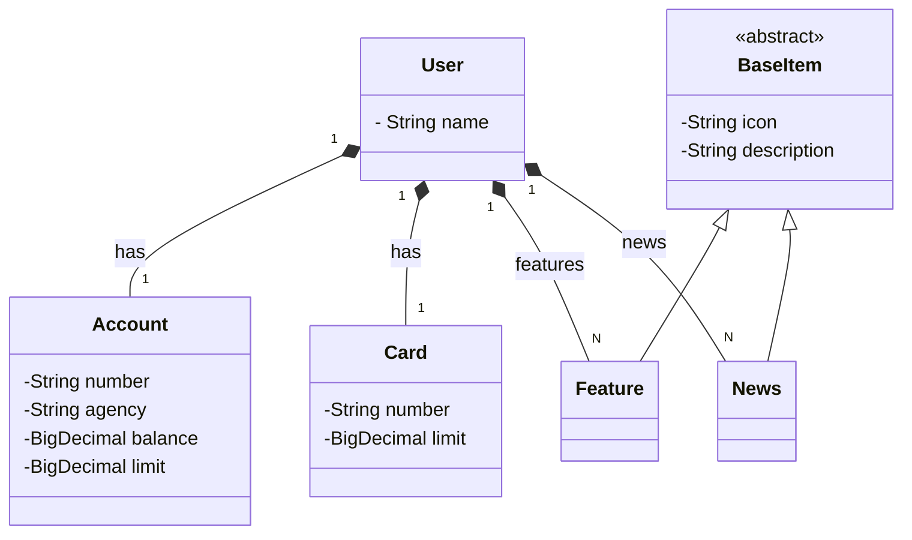

# Projeto Santander API
Java RESTful API criada para representar de maneira bem simples os conceitos de RESTful APIs utilizando uma abstração de conceitos simples de banco.

## Diagrama de Classes



## Tecnologias utilizadas

- **Java 21**
- **Spring Boot 3**
  - Spring Web (API REST)
  - Spring Data JPA (persistência de dados)
- **Hibernate / JPA**
- **Maven** (build e gerenciamento de dependências)
- **Springdoc OpenAPI** (documentação da API)

### Bancos de dados por perfil

- **dev**
  - **H2 Database**
  - Configuração automática
  - Não requer variáveis de ambiente adicionais

- **prod**
  - **PostgreSQL**
  - Requer configuração manual das variáveis de ambiente do banco de dados
  - Indicado para ambientes de produção

## Documentação da API (Swagger)

A aplicação disponibiliza documentação interativa da API via **Swagger UI**, gerada automaticamente pelo Springdoc OpenAPI.

Após subir a aplicação, a documentação pode ser acessada em: `/swagger-ui/index.html`

## Perfis de Execução: `dev` e `prod`

O projeto tem dois perfis disponiveis, desenvolvedor **dev** e produção **prod**.

### Perfil `dev` (padrão)
O perfil **dev** é o perfil padrão da aplicação, utilizado para facilitar o desenvolvimento em ambiente local.

- Não requer nenhuma configuração adicional
- Ideal para desenvolvimento e testes locais
- Permite subir a aplicação imediatamente após clonar o projeto
- O banco em memoria **H2** é resetado toda vez que a aplicação é executada

### Perfil `prod` (produção)
O perfil **prod** é destinado a ambientes de produção e exige configurações adicionais por motivos de infraestrutura e segurança. 

- Requer configuração explícita de variáveis de ambiente
- As credenciais do banco de dados **não** ficam no código
- Exige configurações específicas de serviços externos
- Deve ser utilizado apenas em ambientes controlados, pois trata-se de um projeto simples

### Observação
Por padrão, o projeto está configurado para rodar em **dev**.  
Para utilizar o perfil **prod**, é necessário mudar o perfil no arquivo `application.yml`

## Como rodar o projeto

### Pré-requisitos

- **Java 21** instalado
- **Maven** configurado
- **Git** (opcional, para clonar o repositório)
- **PostgreSQL** (opcional, caso deseje rodar o banco em produção)

---

### Executando em ambiente de desenvolvimento (dev)

O perfil **dev** é o perfil padrão da aplicação e **não requer configurações adicionais**.

1. Clone o repositório:
   ```bash
   git clone <url-do-repositorio>
   cd santander-api-projeto
2. Execute a aplicação:
   ```bash
   mvn spring-boot:run
   ```

### Executando em ambiente de produção (prod)

Para rodar no perfil prod, primeiro é preciso mudar a configuração no arquivo `application.yml`, em `active` troque **dev** por **prod**.

```bash
spring:
  profiles:
    active: prod
```

Após isso, é necessário configurar previamente as variáveis de ambiente do banco de dados.

Exemplo de variáveis de ambiente:

```bash
PGHOST=localhost
PGPORT=5432
PGDATABASE=seu_banco
PGUSER=usuario
PGPASSWORD=senha
```

Após configurar as variáveis, execute a aplicação normalmente:

```bash
mvn spring-boot:run
```
