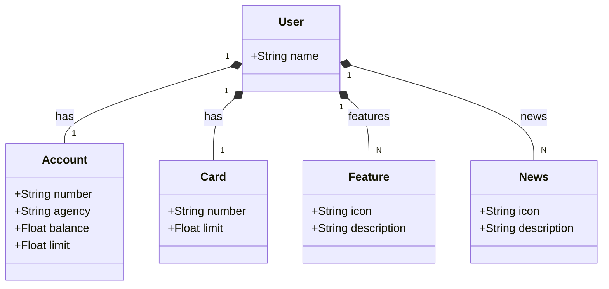

# Projeto Santander API
Java RESTful API criada para representar de maneira bem simples os conceitos de RESTful APIs utilizando uma interface semelhante ao Santander.

## Diagrama de Classes

```mermaid

classDiagram
    class User {
        +String name
    }

    class Account {
        +String number
        +String agency
        +Float balance
        +Float limit
    }

    class Feature {
        +String icon
        +String description
    }

    class Card {
        +String number
        +Float limit
    }

    class News {
        +String icon
        +String description
    }

    User "1" *-- "1" Account : has
    User "1" *-- "1" Card : has
    User "1" *-- "N" Feature : features
    User "1" *-- "N" News : news

```
